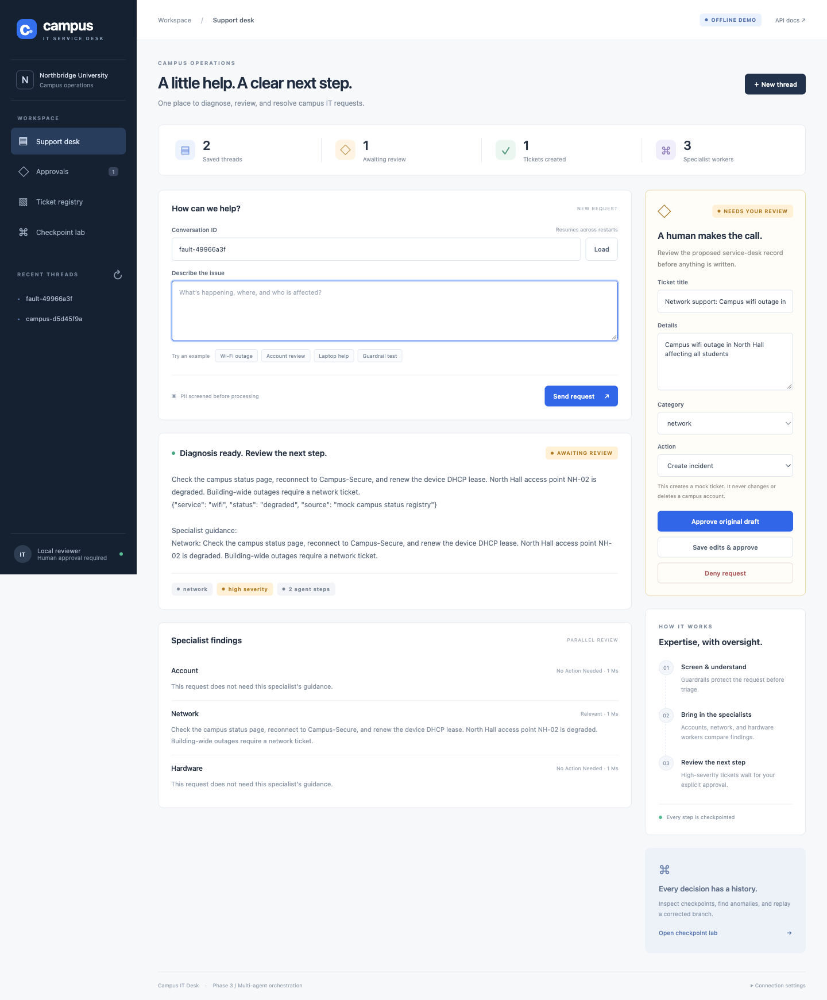
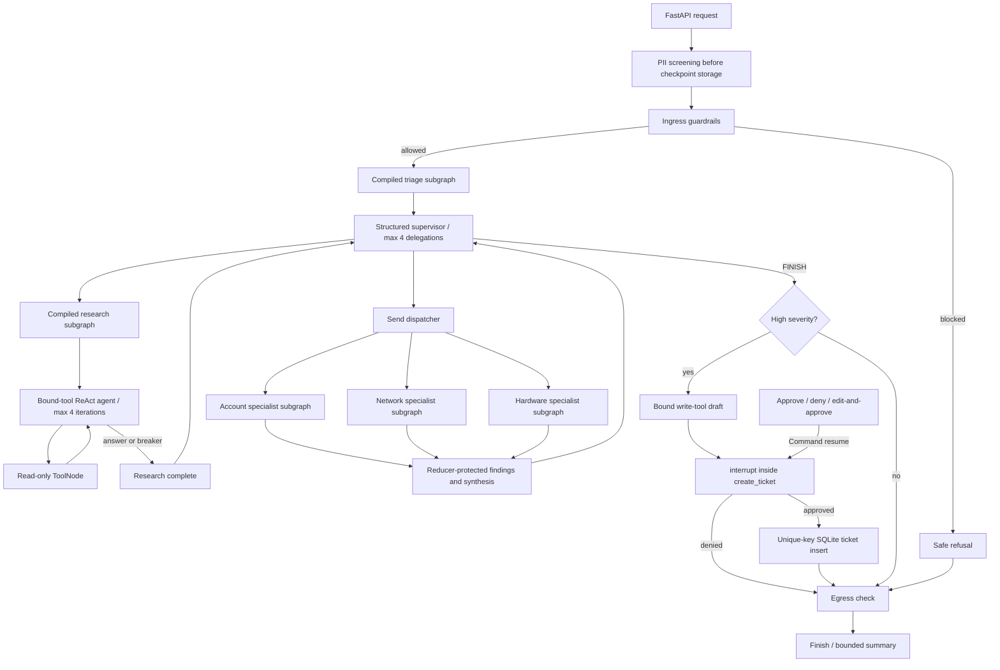

# Campus IT Desk — Phase 3

**Chosen domain: Campus IT Helpdesk (Option 1).** An original campus support application demonstrating LangGraph orchestration, durable checkpoints, human-approved writes, and time-travel debugging.

**Submission option B: GitHub repository.** Runs locally with Python 3.12; no Docker, GPU, frontend build, or external database required. Campus records and service status are fictional. A ticket is a real row in a local mock service-desk database; this app never deletes actual accounts.



## Run locally (about 5 minutes)

From the repository root:

```sh
python3.12 -m venv .venv
source .venv/bin/activate
python -m pip install -r requirements.txt
cp .env.example .env
python -m uvicorn app.api:app --host 127.0.0.1 --port 8000
```

On Windows, activate with `.venv\Scripts\activate` and copy the environment example with `copy .env.example .env`. Do not overwrite an existing `.env` containing your key.

Open **http://127.0.0.1:8000**. Interactive API documentation is at **http://127.0.0.1:8000/docs**. Use one server worker. Stop with Ctrl+C. Both SQLite files persist under `data/`; restarting the server preserves conversations and pending reviews. The reference PDFs in `ref/` are not needed at runtime and are intentionally excluded from Git.

### Offline demo vs live model providers

The default `MODEL_MODE=demo` is a **deterministic test double**, not an LLM. It runs the same real StateGraph, ToolNode, Send fan-out, SQLite persistence, interrupt, approval, and replay paths as live mode. It lets a reviewer verify control flow without credentials.

For live **Command Code**, edit `.env`:

```dotenv
MODEL_MODE=live
LLM_PROVIDER=commandcode
CMD_API_KEY=your-local-key
CMD_MODEL=gpt-5.4-mini
```

Restart the server. The badge changes to **COMMAND CODE · LIVE**. The key stays on the server. The existing `ChatOpenAI` client uses `https://api.commandcode.ai/provider/v1`; no additional SDK is needed. The default `gpt-5.4-mini` is listed in the [Command Code model catalog](https://api.commandcode.ai/provider/v1/models) with Chat Completions support. Choose a tool-capable model supporting that endpoint. Claude models on Command Code require the separate Anthropic Messages endpoint and are not supported by this adapter. An API-enabled Command Code plan and a Studio API key are required; see the [provider documentation](https://commandcode.ai/docs/provider).

OpenRouter remains available by setting:

```dotenv
MODEL_MODE=live
LLM_PROVIDER=openrouter
OPENROUTER_API_KEY=your-local-key
OPENROUTER_MODEL=openai/gpt-4.1-mini
```

That selection uses `https://openrouter.ai/api/v1`. Live mode uses `with_structured_output(..., method="function_calling")` for classification, supervisor decisions and specialist findings, and `bind_tools()` for research and ticket drafting. Provider failures surface as errors; there is no silent fallback to demo mode or another provider.

Run the optional live check after configuring the key:

```sh
python scripts/live_smoke.py
```

This sends fictional campus requests to the selected provider and consumes API credits. It checks real tool calls, specialist dispatch, an approval interrupt, and denial without writing a ticket. **Live model calls have not been verified because no provider key was configured.** Offline and real-process checks are documented in [verification evidence](docs/VERIFICATION.md).

## What to try

1. Select **Wi-Fi outage**, then **Send request**. Watch node events stream; inspect the network finding and proposed ticket.
2. Choose **Approve original draft**, **Deny request**, or edit fields and choose **Save edits & approve**. Look in **Ticket registry** for the result.
3. Restart the server while another ticket is pending. Load its conversation ID and review it; the same interrupt survives.
4. Send **Guardrail test** or `Write a pizza recipe`. They are blocked before any model call.
5. Open **Checkpoint lab → Create fault demo → Find bad checkpoint → Replay corrected branch**. The bad checkpoint remains in the timeline and the repaired branch pauses for new approval.

The full [demo walkthrough](docs/DEMO.md) covers each evaluation item, including PII masking, memory trimming, loop detection, and idempotency.

## Architecture



The outer graph uses `SqliteSaver` with a required `thread_id`. Triage, research and specialist graphs compile independently. Specialists run concurrently in one superstep; `operator.add` protects the findings channel. A three-party barrier test proves concurrent worker execution rather than inferring it from fast wall time.

| Component | Technology / purpose |
| --- | --- |
| Orchestration | LangGraph StateGraph, ToolNode, Send, Command, interrupt |
| Live models | LangChain ChatOpenAI through Command Code or OpenRouter; configurable tool-capable model |
| API | FastAPI, Pydantic input validation, SSE node events |
| Persistence | SQLite checkpoints in `data/checkpoints.sqlite`; tickets in `data/tickets.sqlite` |
| UI | Accessible native HTML forms, CSS, vanilla JavaScript; same origin as API |
| Checks | Python unittest, HTTP subprocess restart test; pinned dependencies |

### Tools and write policy

- `lookup_campus_account`: fictional CRM-equivalent records for `STU-1001`, `STU-1002`, and `STAFF-2001`; no names or contact data.
- `search_knowledge_base`: campus account, network, hardware and general guidance.
- `check_service_status`: mock campus Wi-Fi/VPN/login status; North Hall Wi-Fi is degraded.
- `create_ticket`: a separately bound write tool. Its injected state/config are hidden from the model schema. It rejects low severity and blocked requests, then calls `interrupt()` **before opening the ticket database**.

The research ToolNode only has read tools. Only high severity produces a draft. Explicit critical phrases (deletion, compromise, outage, unsafe battery/smoke) impose a severity floor even if the live classifier suggests low severity. Account deletion requests create an **account_deletion_review** ticket; they never delete an account.

Review APIs require the current checkpoint ID, preventing stale/double approval. Approved content is validated and redacted again. The database has a unique SHA-256 key over `thread_id + canonical final draft`; retries of the same approved payload produce one record even if the process stops after inserting but before checkpointing. A newly worded live-model draft is different content and may produce a separate ticket after new approval. Denial writes no ticket.

### Guardrails, context and forensics

- Ingress masks emails, card-like numbers, phone-like numbers, and names introduced by `my name is` / `name:` **before the first saved checkpoint and before model calls**. Injection and off-topic patterns block immediately. Logs contain flag names, not raw requests.
- Egress redacts output, blocks detected unsafe instructions, flags uncertainty, and supplies a safe fallback for empty answers. Public snapshots are screened too, including a response shown while approval is pending. Streaming exposes node names, not raw model tokens.
- Each new turn resets transient agent/tool state. After seven completed turns, history shrinks to the last two, with a bounded 1,800-character extractive summary. Historical checkpoints remain available; context trimming does not delete audit history.
- Forensics detects invalid categories, loop/delegation limits, empty terminal responses, missing egress checks, PII after egress, and write-policy violations. `find_bad_checkpoint()` follows parent links to the first appearance of the latest detected anomaly.
- `apply_correction()` only accepts a category correction. `time_travel()` creates a new checkpoint branch in the same thread and re-runs downstream workers from the triage boundary. It resets transient draft/write state, rejects blocked sources and requires fresh human approval. Original checkpoint IDs remain unchanged; the UI shows parent IDs and `branch_from`.

## Genuine incremental build history

Each stage was implemented, checked, and committed before the next. The early commits contain working smaller systems; they are not copies of the completed application. `git log --reverse --oneline` shows the progression. All stages were built during this project session; no historical dates or classroom sessions are implied.

| Stage | Addition | Evidence |
| --- | --- | --- |
| 1 | Typed state and classify/category skeleton | Four category routing cases |
| 2 | Three bound read tools and ToolNode | Actual tool-call names and campus facts |
| 3 | ReAct iteration cap and duplicate fingerprints | Adversarial model doubles stop without timing out |
| 4 | SQLite checkpoints and run/stream entry points | Separate processes continue a thread |
| 5 | Context summary and trimming | Seven turns become two plus summary |
| 6 | Ingress and egress guardrails | No model calls for blocked input; sample PII absent from checkpoints |
| 7 | Independently compiled subgraphs | Standalone triage/research checks |
| 8 | Structured supervisor and delegation cap | research → specialist → FINISH; cap checked before model call |
| 9 | Send fan-out and synthesis | Three-party barrier proves concurrency |
| 10 | Severity-gated idempotent write tool | Mandatory interrupt before ticket DB access |
| 11 | Human review APIs and initial working UI | Approve/deny/edit, stale review rejection, restart resume |
| 12 | Forensics, category repair, replay and integrated checkpoint UI | Original checkpoint preserved; replay requires fresh approval |

The mandatory write interrupt was introduced together with the write tool in stage 10 so no intermediate revision could silently write. Stage 11 added the external human-review controls.

## API surface

| Method | Path | Purpose |
| --- | --- | --- |
| GET | `/health` | Health and configured model mode |
| POST | `/run` | Run a new turn; body `{thread_id, text}` |
| POST | `/stream` | Same input; SSE `step`, `result`, or `error` events |
| GET | `/threads` / `/threads/{thread_id}` | Saved conversations / snapshot |
| GET | `/pending-approvals` | Latest pending reviews across threads |
| POST | `/approve` / `/deny` | `{thread_id, checkpoint_id}` |
| POST | `/edit-and-approve` | Review identifiers plus validated `draft` |
| GET | `/tickets` | Durable approved mock tickets |
| GET | `/forensics/{thread_id}` | Checkpoint timeline and anomaly origin |
| POST | `/threads/{thread_id}/time-travel` | `{checkpoint_id, category}`; constrained replay |
| POST | `/threads/{thread_id}/demo-fault` | Controlled invalid-category fault on a new thread; demo mode only |

Example:

```sh
curl -s http://127.0.0.1:8000/run \
  -H 'Content-Type: application/json' \
  -d '{"thread_id":"campus-demo","text":"Campus wifi outage for all students"}'
```

Copy the returned `checkpoint_id` into `/approve`, `/deny`, or `/edit-and-approve`. Sending another turn to an unfinished thread is rejected; resolve the pending review or use the checkpoint lab to repair an interrupted downstream run.

## Verify

```sh
python -m unittest discover -s tests -v
```

The suite includes a real Uvicorn process that is killed while approval is pending, then restarted against the same SQLite directory and resumed over HTTP. All test databases are temporary. Tests force demo mode and never use your model key. See [verification evidence](docs/VERIFICATION.md) and [demo walkthrough](docs/DEMO.md).

## Scope and deployment limits

This is a local assessment application with production-oriented controls, **not a production campus identity system**. Regex guardrails are demonstrable heuristics, not comprehensive PII detection or injection immunity; names outside the supported introductory patterns may remain. The summary is extractive and can lose older details. There is no RAG, DSPy, model serving, semantic cache or fallback cascade.

SQLite plus an in-process lock supports **one application worker** and serializes requests, while workers inside a graph still run concurrently. Keep `data/` on a persistent local disk. Multi-worker deployment requires shared persistence and distributed per-thread coordination. Checkpoint storage and the thread list have no retention policy or pagination in this small demo.

Local access is allowed without a token only from loopback. To expose the service, configure a long random `API_TOKEN`; send it as `Authorization: Bearer ...`, or enter it in the UI's Connection settings. The token is session-scoped in the browser. Cross-origin mutation requests are rejected. A shared token does not provide per-user roles or an enterprise audit identity; add those before a real multi-user deployment. No public deployment or GitHub publication is included in the initial local build.

## Sources

Architecture requirements come from the four Phase 3 PDFs in the user's local `ref/` folder. The reference repository was consulted for scope, not copied. Campus data, policies, graph implementation and UI were authored for this project.

- [LangGraph interrupts](https://docs.langchain.com/oss/python/langgraph/interrupts)
- [LangGraph time travel](https://docs.langchain.com/oss/python/langgraph/use-time-travel)
- [LangGraph graph API and Send](https://docs.langchain.com/oss/python/langgraph/graph-api)
- [OpenRouter tool calling](https://openrouter.ai/docs/guides/features/tool-calling)

- [Command Code Provider API](https://commandcode.ai/docs/provider)
